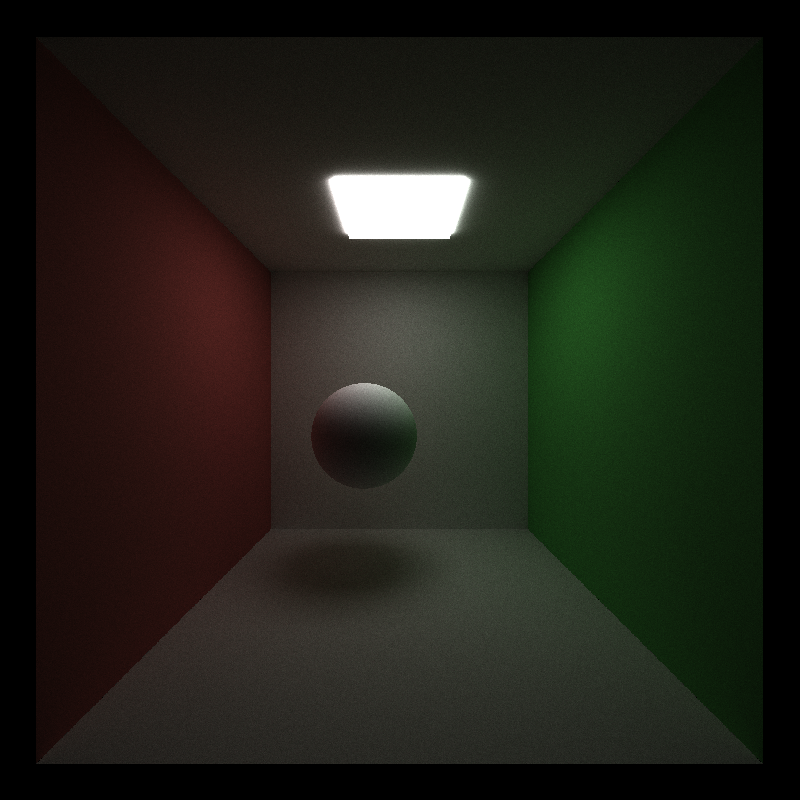
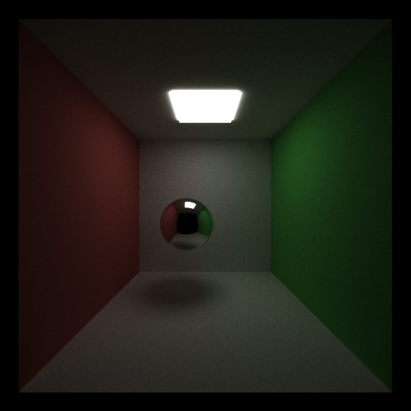
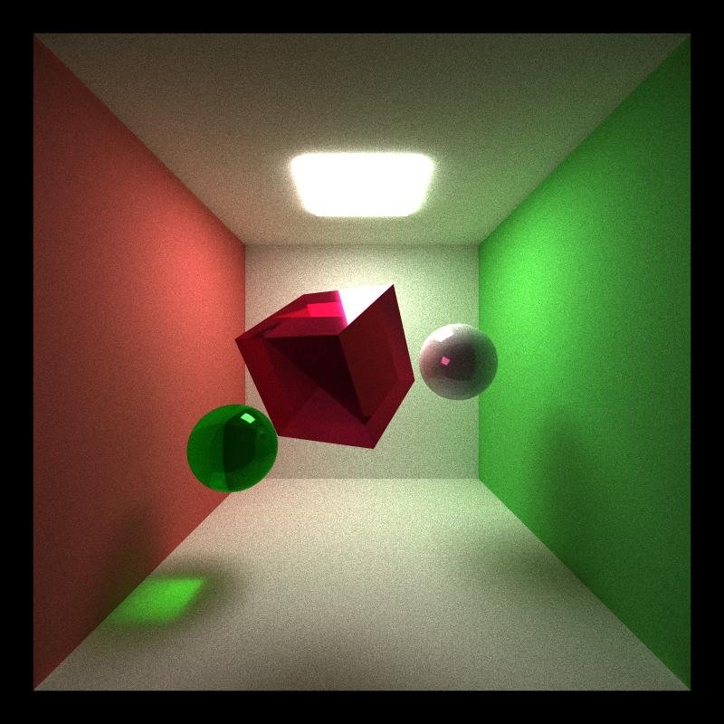
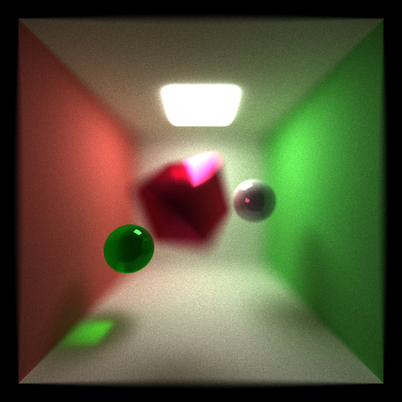
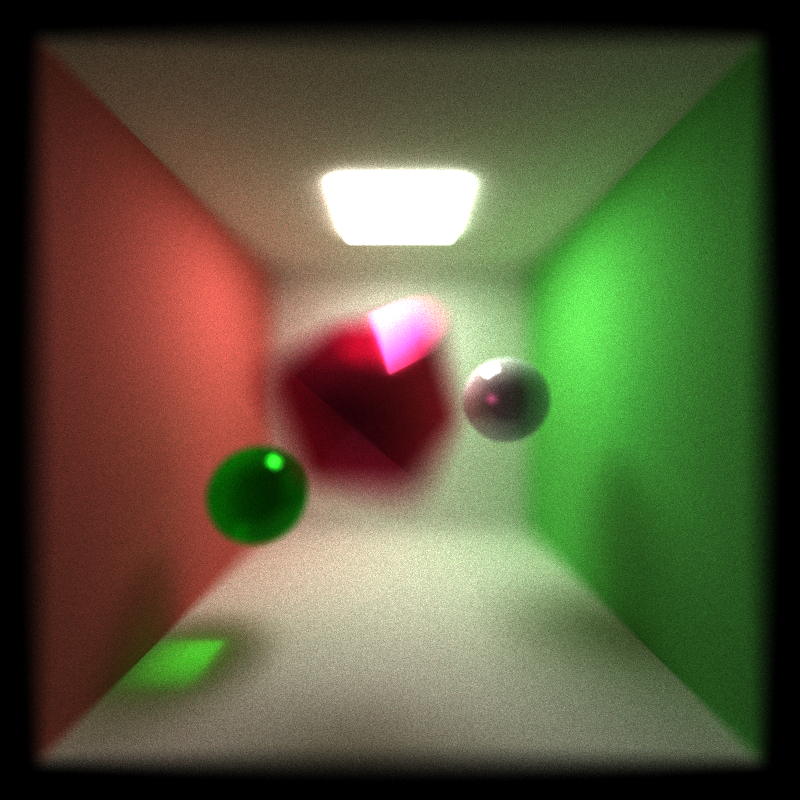
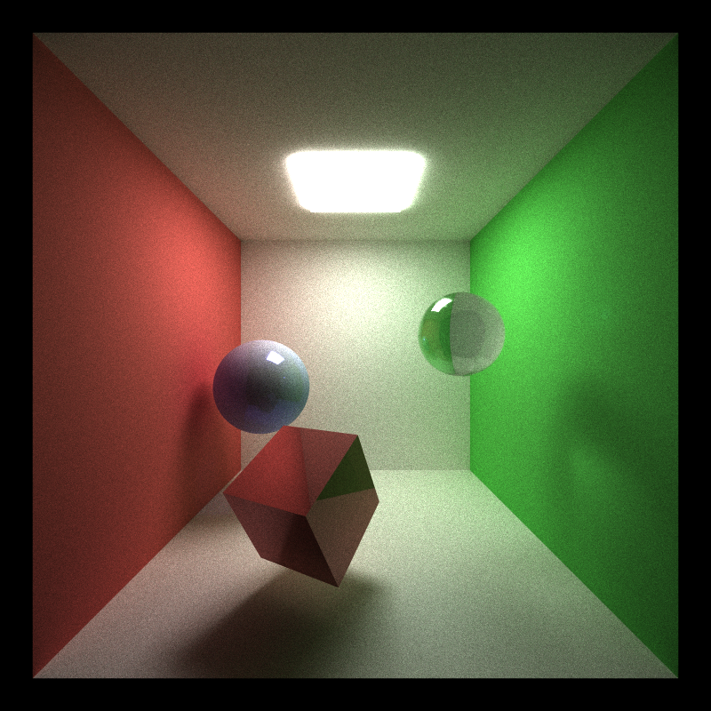
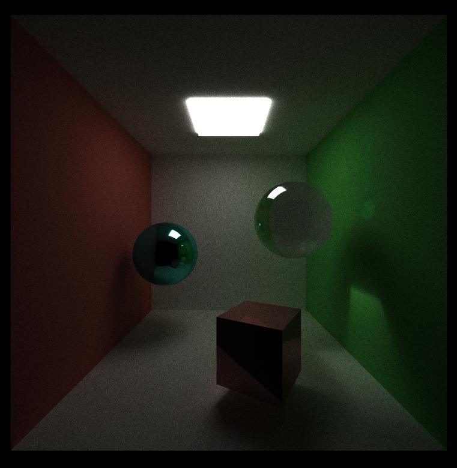
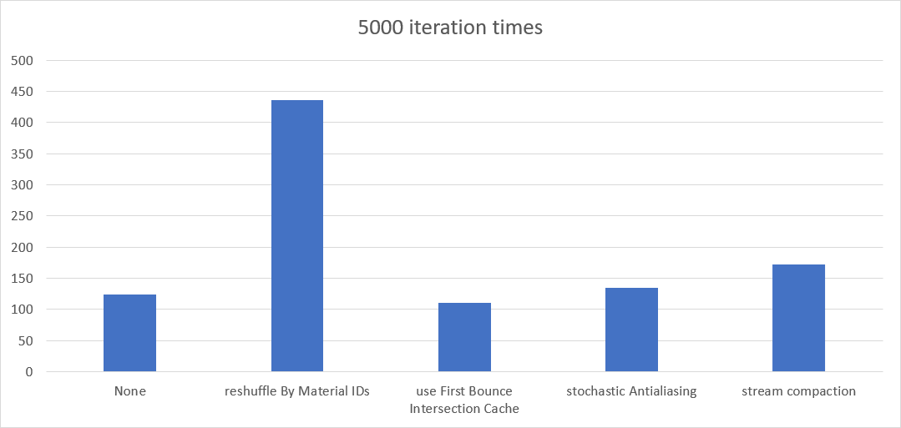

CUDA Path Tracer
================

**University of Pennsylvania, CIS 565: GPU Programming and Architecture, Project 2**

* Jizhou Yan
* Tested on: Windows 10, i7-4789K @ 4.00GHz 32GB, GTX 1080Ti(Personal Desktop)

## Features
* Basic
  * A shading kernel with BSDF evaluation:
	* Ideal Diffuse surfaces
	* Perfectly specular-reflective (mirrored) surfaces
  * Path continuation/termination using Stream Compaction
  * toggle between sorting path/intersection continuous by material type
  * toggle between cache first bounce
* Extra
  * Fresnel Refraction(Schlick's Approximation), Depth of Field and Stochastic AA
  * Motion Blur

## Result

* Ideal Diffuse surfaces
	

* Perfectly specular-reflective surfaces
	

* Depth of Field Comparison
	
	
	

* Motion Blur
	
	

* Fresnel Refraction
	

## Performance Analysis

* Toggleable Methods of First Bounce Intersection Cache, Sort by Material ID and Stream Compaction

	Four options: reshuffleByMaterialIDs, useFirstBounceIntersectionCache and stochasticAntialiasing can be toggled in scene->state varialbe.

	In following chart, only one optimization was applied for each test case. None means all three opts are false.

	

	* sorting by material id: extremely slow. Sorting 640000(maximum) rays twice for each depth intersections? In this framework, path segments and intersections are separated as two arrays, which means either to sort them twice to make them relate to each other or combine them together. Either way will destroy the performance. So the framework is not working well this option and this option is applicable.

	* first bounce intersection cache: this option is not acceptable and applicable when applying anti-aliasing, AA is used for improving rendering quality with only small extra cost, which can be proved from the chart above.

	* stochastic antialising: use trivial cost and improve the rendering quality. Worth to do.

	* When applying stream compaction, the iteration execution time will be smaller than without stream compaction (under same test scene). Since a lot of terminated rays are removed and not able to launch extra kernel calls, the averaged execution time reduces.